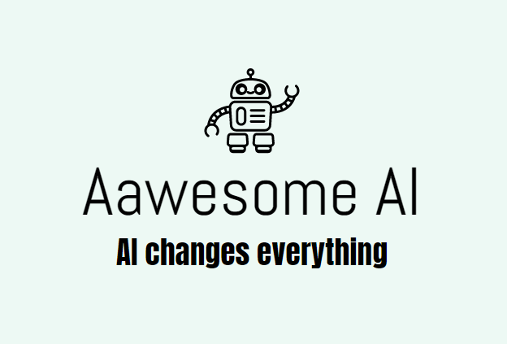
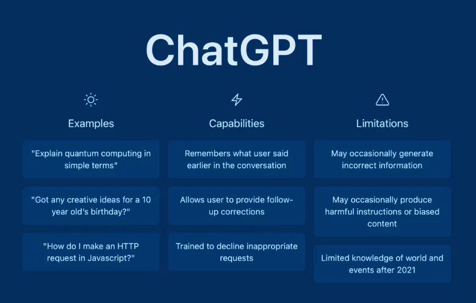
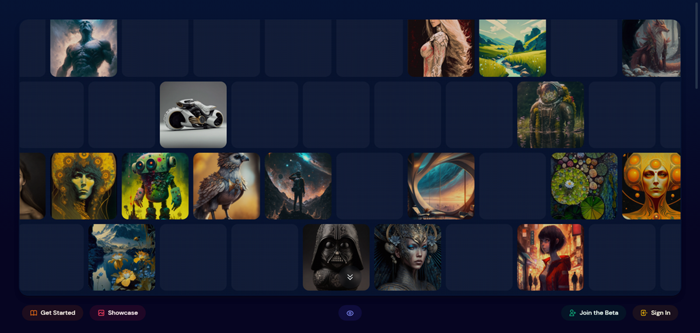
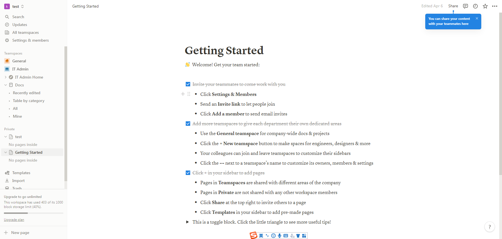
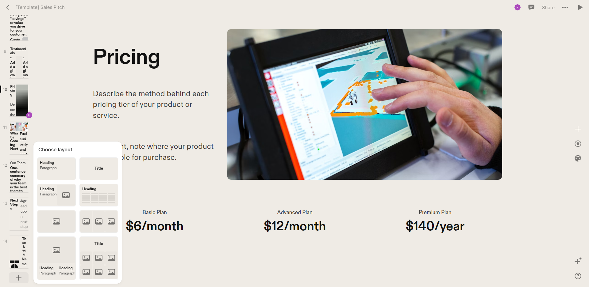
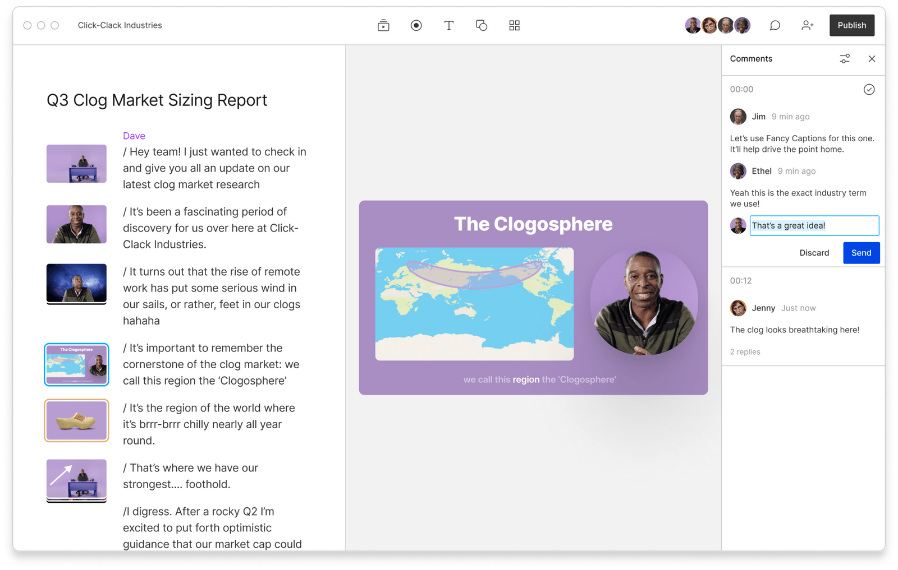
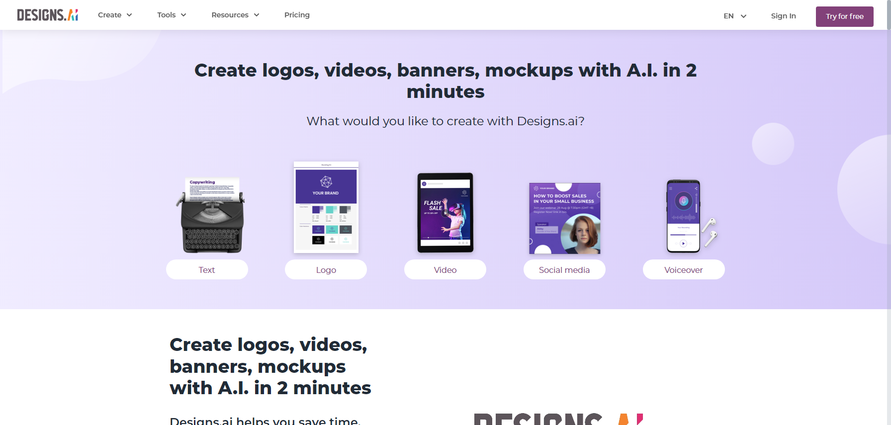

# awesome-ai

Amazing AI technologies and products compilation.

By using these technologies and products, we can greatly enhance our productivity.

## Contributing

Please take a quick gander at the [contribution guidelines](./CONTRIBUTING.md) first. Your contributions will help us discover more amazing AI technologies or products, and we are very excited about it. 

## Contents

- [Awesome AI](#awesome-ai)
    - [Contributing](#contributing)
    - [Contents](#contents)
    - [Platforms](#platforms)
        - [ChatGPT](#ChatGPT)
        - [Midjourney](#Midjourney)
        - [Notion AI](#NotionAI)
        - [Tome](#Tome)
        - [Descript](#Descript)
        - [Designs.AI](#DesignsAI)
        - [PromptBase](#PromptBase)

**[⬆ back to top](#contents)**

## Platforms

Name | Category | Snapshot | Reasons For Recommendation | Disadvantages
---- | ----- | ----- | ----- | -----
<a id="ChatGPT" href="https://chat.openai.com/">ChatGPT</a> | AIGC |  | As an AI language model, ChatGPT has several outstanding features:<ul><li>Natural Language Processing: ChatGPT is designed to understand and respond to natural language queries, making it easier for users to interact with the system.</li><li>Large Knowledge Base: ChatGPT has access to a vast amount of information on the internet, allowing it to provide accurate and relevant answers to a wide range of questions.</li><li>Contextual Understanding: ChatGPT is capable of understanding the context of a conversation, allowing it to provide more accurate and relevant responses.</li><li>Personalization: ChatGPT can learn from previous interactions with users, allowing it to personalize its responses and provide a more tailored experience.</li><li>Multilingual Support: ChatGPT can understand and respond in multiple languages, making it accessible to a global audience.</li></ul>Overall, ChatGPT's ability to understand natural language, access a vast knowledge base, and provide personalized responses makes it a powerful tool for answering questions and engaging with users. | As an AI language model, GPT has some limitations and drawbacks. Here are a few:<ul><li>Lack of common sense: GPT is not capable of understanding common sense or contextual information that humans take for granted. This can lead to nonsensical or irrelevant responses.</li><li>Biased training data: GPT's responses are only as good as the data it was trained on. If the training data is biased or incomplete, GPT's responses may reflect those biases.</li><li>Limited creativity: While GPT can generate text that is grammatically correct and coherent, it lacks the creativity and originality of human writers.</li><li>Inability to understand emotions: GPT is not capable of understanding emotions or empathizing with humans. This can lead to inappropriate or insensitive responses.</li><li>Limited domain knowledge: GPT's knowledge is limited to what it has been trained on. It may not have the domain-specific knowledge required to answer certain types of questions accurately.</li><li>Many regions are restricted from using ChatGPT, such as China. </li></ul>
<a id="Midjourney" href="https://midjourney.com/">Midjourney</a> | Image Generator |  | <ul><li>Join the Midjourney community on Discord or the Web, where thousands collaborate to create new worlds, fantastic characters, and unique imagery from short text descriptions.</li><li>The generated images are almost indistinguishable from reality.</li><li>We can generate 25 free images every day.</li></ul> | 
<a id="NotionAI" href="https://www.notion.so/">Notion AI</a> | AIGC |  | Notion AI has several amazing features that make it stand out from other productivity tools:<ul><li>Advanced database capabilities: Notion AI allows users to create databases with custom fields, filters, and sorting options. This makes it easy to organize and manage large amounts of information.</li><li>Powerful collaboration tools: Notion AI allows multiple users to work on the same document in real-time. Users can leave comments, assign tasks, and track changes, making it easy to collaborate with team members.</li><li>Customizable templates: Notion AI offers a wide range of customizable templates for different use cases, such as project management, note-taking, and personal organization. Users can also create their own templates to suit their specific needs.</li><li>Integration with other tools: Notion AI integrates with a variety of other productivity tools, such as Google Drive, Trello, and Slack. This makes it easy to incorporate Notion AI into existing workflows.</li></ul>Overall, Notion AI's combination of advanced database capabilities, powerful collaboration tools, customizable templates, and integration with other tools make it a versatile and powerful productivity tool. | <ul><li>Steep learning curve: Notion AI has a lot of features and customization options, which can make it overwhelming for new users to learn and navigate.</li><li>Limited formatting options: While Notion AI offers a lot of flexibility in terms of organizing and structuring information, some users have noted that the formatting options for text and media are somewhat limited.</li><li>Performance issues: Some users have reported slow loading times and lag when using Notion AI, particularly when working with large databases or complex pages.</li><li>Pricing: Notion AI's pricing model can be expensive for individuals or small teams, especially if they require advanced features like team collaboration and integrations with other tools.</li></ul>
<a id="Tome" href="https://beta.tome.app/">Tome</a> | PPT |  | <ul><li>Meet Tome, your AI storytelling partner.</li><li>The era of AI-generated storytelling has arrived. Tell it a theme, and it will automatically generate chapters, text, images, videos, and even create a PPT to make your story more vivid and professional.</li></ul> | 
 | Audio and Video |  | <ul><li>Descript is the only tool you need to write, record, transcribe, edit, collaborate, and share your videos and podcasts.</li><li>Make video part of your team's communication toolkit with a tool that makes video recording, editing, and collaboration as easy as docs and slides.</li></ul> | 
 | AIGC |  | <ul><li>Create logos, videos, banners, mockups with A.I. in 2 minutes</li><li>We can try their products for 30 days.</li></ul> |
<a id="PromptBase" href="https://promptbase.com/">PromptBase</a> | Prompt Marketplace |  | <ul><li>DALL·E, GPT, Midjourney, Stable Diffusion, ChatGPT Prompt Marketplace</li><li>Find top prompts, produce better results, save on API costs, sell your own prompts.</li></ul> | <ul><li>Only Stripe accounts are supported for payments.</li></ul>
